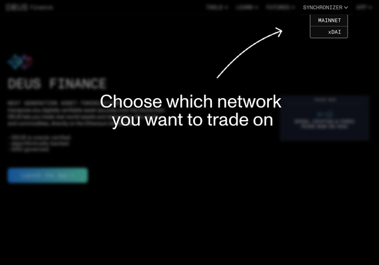
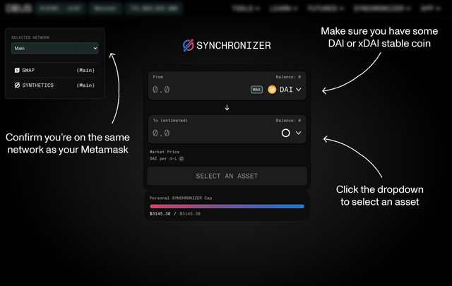
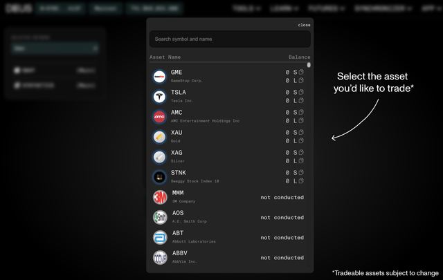
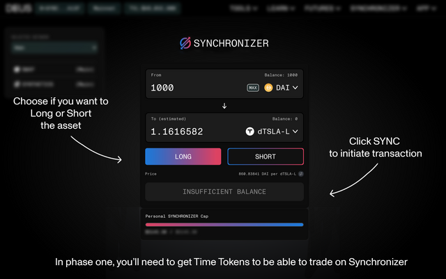
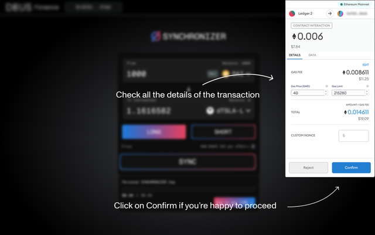
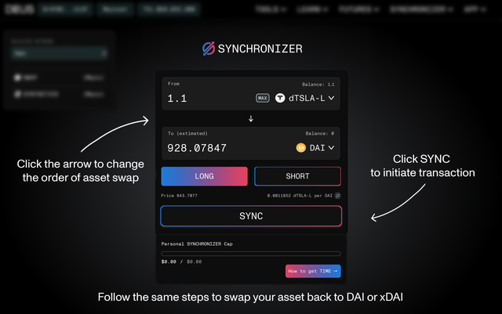

Synchronizer is where you can trade all your favorite Synthethics.
You have two ways of trading, currently without leverage:

Long = Indicates you believe asset will rise in value. Profit potential is unlimited because it may rise indefinitely.

Short = Indicates you believe asset will go down in value. Profit potential is limited to amount of assets you receive.

